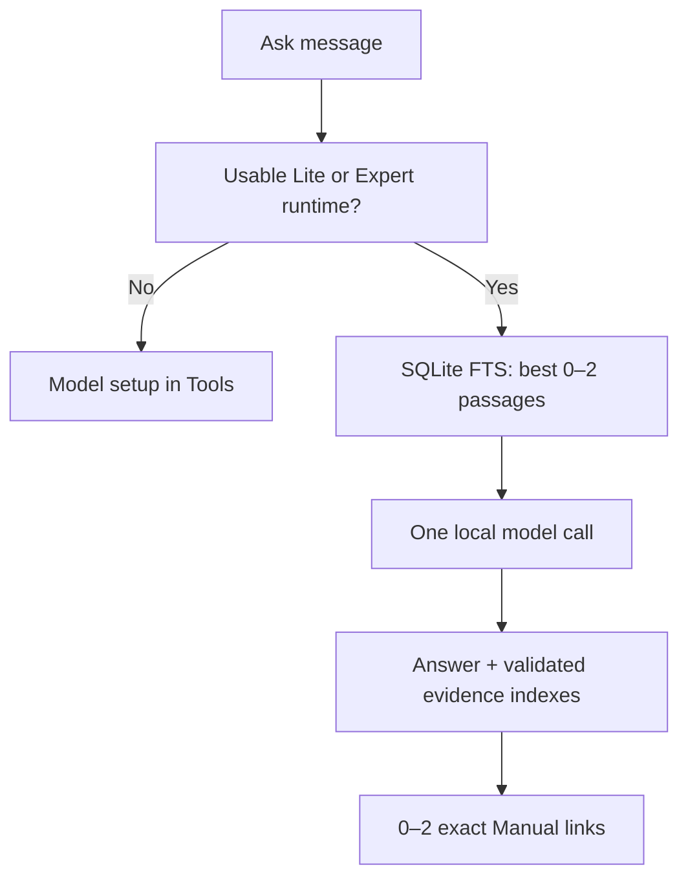

# TrailGuard iOS

TrailGuard is a fully offline iPhone and iPad survival assistant. It combines local model inference, a reviewed field course, an immutable SQLite reference corpus, and signed offline maps. It is an educational aid, not a replacement for emergency services, certified first-aid training, or professional judgment.

## Current product

- Four independent tabs in this order: **Ask · Manual · Maps · Tools**.
- Ask uses an installed on-device model. With no usable model, it shows a setup screen linking directly to Tools; there is no extractive answer fallback.
- Manual uses one versioned SQLite knowledge base with 10 direct wilderness chapters, 70 action lessons, 1,050 indexed passages, primary-source metadata, and 828 reviewed legacy-link dispositions.
- Maps is the dedicated offline-map browser and download manager.
- Tools is a focused model center showing only Lite and Expert, model readiness, selection, eligibility, and signed-catalog controls.
- Signed packages retain Ed25519 verification, SHA-256 checks, path protection, atomic activation, recall, offline entitlements, and preparation/incident network controls.
- Chat has no duplicate SOS or Clear control. Session conversation remains visible. Photo attachment appears only for an approved active Expert vision runtime.

Vehicle and roadside survival guidance remains available in Manual and Ask retrieval. Retired readiness, trip-sheet, vehicle-profile/applicability, OBD, and standalone status subsystems are no longer read or presented; their existing user files are not erased.

## Model contract

| Tier | Target | Runtime state |
| --- | --- | --- |
| Lite | iPhone 13-class and comparable devices | Gemma 3 1B local conversation plus survival RAG; current supported tier |
| Expert (`vision_expert`) | High-memory devices such as iPhone 17 Pro Max and iPad Pro with M2 or newer | Larger 2B-class vision candidate; validation-locked until signed model/projector, mtmd binding, and physical acceptance pass |

Automatic selection recommends the best usable tier from live memory, storage, thermal, Low Power Mode, package trust, recall, and runtime availability. Device names provide target messaging only. Expert degrades to Lite when its gates fail. Legacy Essential or Field preferences migrate to Lite, and legacy Field packages cannot activate.

## Open and verify

Requirements:

- Xcode with an iOS 17 or newer SDK
- XcodeGen (`brew install xcodegen`)

```bash
xcodegen generate
open TrailGuard.xcodeproj

python3 tools/validate.py
swift test
```

The app target is universal (`TARGETED_DEVICE_FAMILY = 1,2`). Model and map downloads are the only network-capable product flows, and are available only during explicit Preparation mode.

## Architecture



Key files:

- `App/RootView.swift` — four-tab shell with independent navigation roots.
- `App/ToolsView.swift` — two-tier model center.
- `App/MapPackView.swift` — dedicated maps product area.
- `App/GuideLibraryView.swift` — course-first Manual and deep reference browser.
- `Core/ModelRouter.swift` — automatic/manual selection and live eligibility.
- `Core/ModelPreferenceStore.swift` — focused preference persistence and legacy migration.
- `Core/IncidentAssistant.swift` — local model orchestration and exact Manual links.
- `Core/SurvivalKnowledge.swift` — unified read-only Manual, FTS5 retrieval, sources, fallback, and legacy navigation.
- `Resources/Models/catalog.json` — Lite and Expert package metadata.
- `Docs/FIELD_MANUAL_PROGRESS_REPORT.md` — current implementation and acceptance evidence.

The llama.cpp runtime remains checksum-pinned to `b9637`. Model weights are not stored in this repository. See `Docs/MODEL_EXPERIMENTS.md`, `Docs/PHYSICAL_DEVICE_VALIDATION.md`, and `Docs/IMPLEMENTATION_STATUS.md` for current gates.
