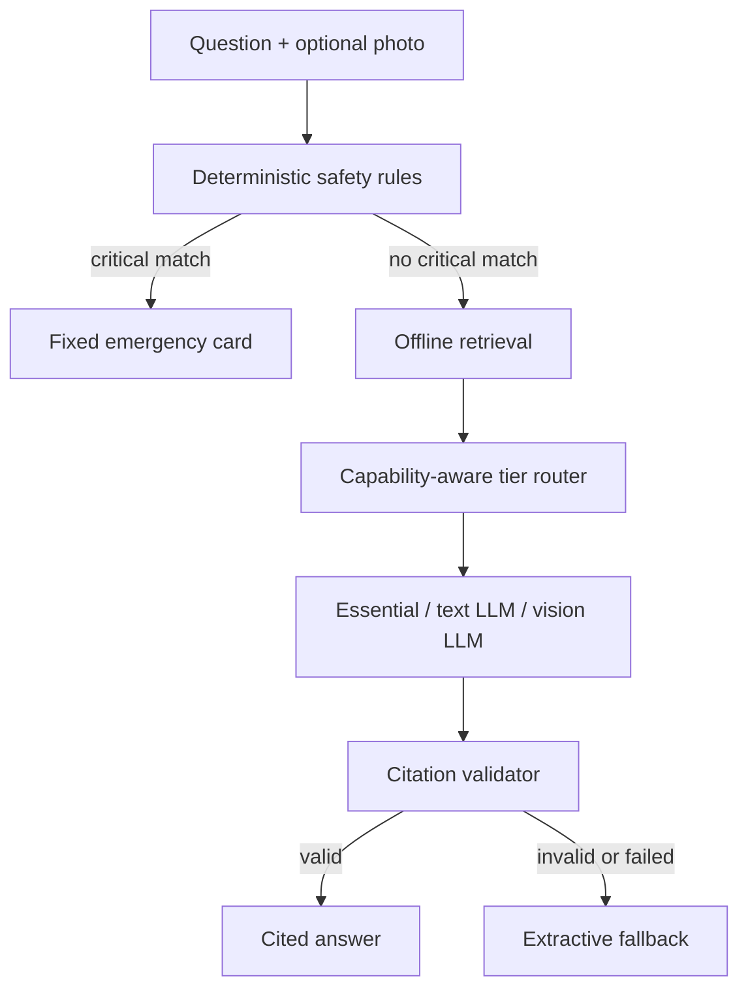

# TrailGuard iOS MVP

TrailGuard is a fully offline incident-assistant prototype for vehicle breakdowns,
wilderness problems, navigation, and layperson first aid. This repository now
contains the working vertical slice plus the first production foundations.

It is intentionally **not** an autonomous mechanic, doctor, or surgeon. The app
puts fixed hazard rules and reviewed evidence ahead of model output.

## What is implemented

- SwiftUI iPhone shell with Ask, Guide, Readiness, and Models tabs.
- Deterministic critical-hazard screening before any model invocation.
- Offline keyword retrieval over a bundled, source-attributed starter pack.
- Runtime retrieval over verified compiled SQLite FTS5/vector knowledge packs,
  with deterministic rank fusion and applicability filtering.
- Citation validation with an extractive fallback when generation is uncited.
- Essential, Field, and Vision Expert routing with runtime memory, storage,
  thermal-state, and Low Power Mode gates.
- Photo attachment and fully offline Apple Vision OCR on every tier.
- A Qwen3-VL-2B/llama.cpp integration seam for capable high-tier devices.
- A pre-trip readiness checklist and an explicit zero-power contingency.
- Persistent vehicle profile, readiness completion, and preferred model tier.
- A signed package pipeline with Ed25519 signatures, per-file SHA-256 checks,
  path-traversal protection, atomic activation, rollback, and recall.
- Launch-time active-pack resolution that rechecks recall, package identity,
  signatures/hashes, app and policy compatibility, cached entitlement, review
  state, and device eligibility before exposing an installed tier.
- A reproducible knowledge-pack compiler that creates SQLite/FTS, precomputed
  vector artifacts, canonical manifests, and Ed25519 envelopes.
- Typed grounded responses that reject unknown evidence, invented procedures,
  uncited supported answers, and unsafe high-risk continuation.
- Live llama/Qwen responses resolve exact installed step IDs and verbatim
  warnings before any procedural text is rendered.
- Incident-mode network containment, cached offline entitlements, and bundled
  emergency-core recovery after first launch or corruption.
- Strict HTTP byte-range package resume connected to verified installation.
- A StoreKit verification bridge with persistent purchase, restore, refund,
  revocation, and offline-launch state.
- Exact vehicle identity and wrong-vehicle retrieval exclusion.
- Exact vehicle-document revision and applicability ingestion validation.
- Offline map-pack coverage, detail, freshness, and routing readiness checks.
- A dependency-free local map runtime boundary ready for licensed MapLibre data.
- A whitelist-only OBD protocol that cannot clear codes or write to an ECU.
- Vehicle-bound local OBD observation records with raw responses and sources.
- A llama.cpp backend contract for both text-only and Qwen vision packages.
- Eighty-eight Swift tests, 120 executed synthetic gold incidents, 30 executed
  map/asset cases,
  seven versioned schemas, locked safety fixtures, and GitHub Actions for core,
  reproducible packs, and iOS builds.

The app is functional without model weights: Essential mode retrieves and
formats reviewed offline material. Field and Vision Expert remain unavailable
until model artifacts are licensed, signed, hosted, and accepted on physical
iPhones. The package installer and runtime boundary are implemented; model
weights and the compiled llama.cpp bridge are not stored here.

## Product-tier contract

| Tier | Model behavior | Photo behavior | Safety and facts |
| --- | --- | --- | --- |
| Essential | Extractive; no LLM required | On-device OCR | Same deterministic rules and knowledge |
| Field | Small text-only local LLM | OCR text is added to retrieval | Same deterministic rules and knowledge |
| Vision Expert | Qwen3-VL-2B candidate | OCR plus multimodal observation | Same deterministic rules and knowledge |

Vision Expert is expected to be practical only on higher-memory iPhones such as
the iPhone 17 Pro Max class, but the code does not trust a marketing name.
`ModelRouter` checks live physical memory, storage, thermal state, and Low Power
Mode. Device eligibility is still provisional until it passes the experiment
gates in [Docs/MODEL_EXPERIMENTS.md](Docs/MODEL_EXPERIMENTS.md).

## Open and run on a Mac

Requirements:

- Xcode with an iOS 17 or newer SDK
- XcodeGen (`brew install xcodegen`)

```bash
make project
open TrailGuard.xcodeproj
```

Select an iPhone simulator or a signing team and physical iPhone, then run the
`TrailGuard` scheme. The included app does not make network calls.

Core tests can also run as a Swift package:

```bash
swift test
python3 -m pip install -r requirements-dev.txt
python3 tools/validate.py
python3 tools/test_pack_reproducibility.py
```

On a Windows development workstation with Ollama already running, the installed
Gemma, Qwen, and Qwen embedding models can be exercised without connecting them
to Incident Mode:

```powershell
python tools/local_model_smoke.py `
  --output Reports/local-model-smoke.json
```

This is an off-device evaluation harness, not the iOS runtime. The app now links
a checksum-pinned official llama.cpp XCFramework on macOS. Optional model tiers
still require signed model packaging, startup activation, and physical-device
inference evidence. The exact MIT-licensed Phi-3.5 Mini Q4_K_M Lite candidate is
selected and workstation-verified in `Docs/LITE_MODEL_HANDOFF.md`, but remains
unbundled and inactive.

Local verification on 2026-07-28 used Xcode 26.6 and the iOS 26.5 Simulator:
all 94 Swift package and simulator tests passed on iPhone and iPad form factors.
Three new grounded-generation tests bring the source inventory to 97 and still
require a Mac rerun after the grammar-bridge change.
The universal app also built, installed, and launched on a physical iPhone 13
and M2 iPad Pro. The GitHub Actions workflow runs Swift package tests and an
unsigned simulator build.
Physical-device memory, heat, battery, camera, Bluetooth, and map tests remain
required.

## Architecture at a glance



Key source files:

- `Core/SafetyEngine.swift` — rules that bypass the model.
- `Core/RetrievalEngine.swift` — offline evidence selection.
- `Core/ModelRouter.swift` — dynamic model-tier eligibility.
- `Core/IncidentAssistant.swift` — end-to-end orchestration.
- `Core/GroundedPromptBuilder.swift` — evidence-only runtime contract.
- `Core/PackageVerifier.swift` — signed package and artifact verification.
- `Core/ActivePackRegistry.swift` — fail-closed startup package resolution.
- `Core/PreparationStateStore.swift` — persisted readiness and vehicle state.
- `Core/GroundedResponse.swift` — typed evidence/procedure output validation.
- `Core/GroundedResponseCodec.swift` — exact step/warning resolution and rendering.
- `Core/EmergencyCoreStore.swift` — first-launch and corruption recovery.
- `Core/IncidentNetworkPolicy.swift` — offline incident containment.
- `Core/EntitlementLedger.swift` — verified offline purchase state.
- `Core/OfflineMapRuntime.swift` — local map-pack open boundary.
- `Core/OBDObservationStore.swift` — vehicle-bound diagnostic history.
- `Core/VehicleDocumentIngestor.swift` — exact manual/applicability validation.
- `Core/ReleaseValidation.swift` — model and virtual release acceptance gates.
- `Core/VehicleIdentity.swift` — exact vehicle applicability.
- `Core/OfflineMapPack.swift` — map readiness contract.
- `Core/OBDProtocol.swift` — read-only diagnostic protocol.
- `Core/LlamaRuntimeAdapter.swift` — text/vision backend boundary.
- `App/VisionTextExtractor.swift` — on-device OCR fallback.
- `Resources/Models/catalog.json` — tier candidates and gates.
- `Schemas/` — independently versioned runtime and distribution contracts.
- `Docs/ADR/` — binding architecture decisions.

## Current external technical basis

- [Qwen3-VL-2B-Instruct official model card](https://huggingface.co/Qwen/Qwen3-VL-2B-Instruct)
- [Official Qwen3-VL-2B GGUF repository](https://huggingface.co/Qwen/Qwen3-VL-2B-Instruct-GGUF)
- [llama.cpp](https://github.com/ggml-org/llama.cpp)
- [Apple Vision framework](https://developer.apple.com/documentation/vision)
- [Apple Foundation Models framework](https://developer.apple.com/documentation/foundationmodels)

These links establish candidate capability, not product fitness. TrailGuard must
pass its own vehicle-photo, first-aid-safety, latency, memory, heat, and battery
tests.

## Safety status

Incident questions and photos stay offline. The only network-capable component
is the explicit package downloader, which accepts content only after signature
and hash verification.

This repository is an engineering prototype. The starter articles have complete
source metadata and pass the ingestion gate, but the pack has **not** completed
clinical, wilderness-instructor, mechanic, legal, localization, or regional
emergency-number review. Do not ship it as emergency guidance in its current
form.

See [Docs/ARCHITECTURE.md](Docs/ARCHITECTURE.md),
[Docs/SAFETY_CASE.md](Docs/SAFETY_CASE.md), and
[Docs/IMPLEMENTATION_STATUS.md](Docs/IMPLEMENTATION_STATUS.md). External
certification and hardware blockers are tracked in
[Docs/EXTERNAL_GATES.md](Docs/EXTERNAL_GATES.md).
