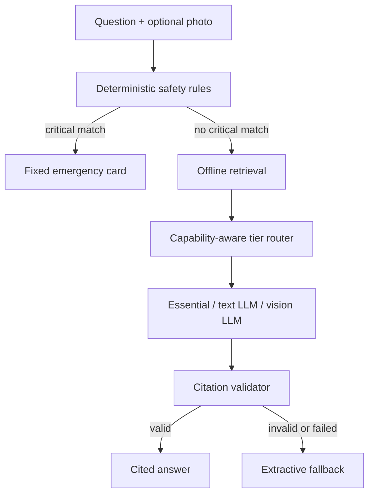

# Aurora iOS MVP

Aurora is a fully offline incident-assistant prototype for vehicle breakdowns,
wilderness problems, navigation, and layperson first aid. This repository is the
first working vertical slice of the product architecture.

It is intentionally **not** an autonomous mechanic, doctor, or surgeon. The app
puts fixed hazard rules and reviewed evidence ahead of model output.

## What is implemented

- SwiftUI iPhone shell with Ask, Guide, Readiness, and Models tabs.
- Deterministic critical-hazard screening before any model invocation.
- Offline keyword retrieval over a bundled, source-attributed starter pack.
- Citation validation with an extractive fallback when generation is uncited.
- Essential, Field, and Vision Expert routing with runtime memory, storage,
  thermal-state, and Low Power Mode gates.
- Photo attachment and fully offline Apple Vision OCR on every tier.
- A Qwen3-VL-2B/llama.cpp integration seam for capable high-tier devices.
- A pre-trip readiness checklist and an explicit zero-power contingency.
- Fifteen Swift unit tests plus dependency-free structural validation.

The app is functional without model weights: Essential mode retrieves and
formats reviewed offline material. Field and Vision Expert intentionally remain
uninstallable in this repository until signed model hosting, license review, and
real-device acceptance benchmarks are complete.

## Product-tier contract

| Tier | Model behavior | Photo behavior | Safety and facts |
| --- | --- | --- | --- |
| Essential | Extractive; no LLM required | On-device OCR | Same deterministic rules and knowledge |
| Field | Small text-only local LLM | OCR text is added to retrieval | Same deterministic rules and knowledge |
| Vision Expert | Qwen3-VL-2B candidate | OCR plus multimodal observation | Same deterministic rules and knowledge |

Vision Expert is expected to be practical only on higher-memory iPhones such as
the iPhone 17 Pro Max class, but the code does not trust a marketing name.
`ModelRouter` checks live physical memory, storage, thermal state, and Low Power
Mode. Device eligibility is still provisional until it passes the experiment
gates in [Docs/MODEL_EXPERIMENTS.md](Docs/MODEL_EXPERIMENTS.md).

## Open and run on a Mac

Requirements:

- Xcode with an iOS 17 or newer SDK
- XcodeGen (`brew install xcodegen`)

```bash
make project
open Aurora.xcodeproj
```

Select an iPhone simulator or a signing team and physical iPhone, then run the
`Aurora` scheme. The included app does not make network calls.

Core tests can also run as a Swift package:

```bash
swift test
python3 tools/validate.py
```

This Linux build environment does not contain Xcode or Swift, so the checked-in
validation script is the executable verification path here. Compile and
real-device tests remain required before distribution.

## Architecture at a glance



Key source files:

- `Core/SafetyEngine.swift` — rules that bypass the model.
- `Core/RetrievalEngine.swift` — offline evidence selection.
- `Core/ModelRouter.swift` — dynamic model-tier eligibility.
- `Core/IncidentAssistant.swift` — end-to-end orchestration.
- `Core/GroundedPromptBuilder.swift` — evidence-only runtime contract.
- `App/VisionTextExtractor.swift` — on-device OCR fallback.
- `Resources/Models/catalog.json` — tier candidates and gates.

## Current external technical basis

- [Qwen3-VL-2B-Instruct official model card](https://huggingface.co/Qwen/Qwen3-VL-2B-Instruct)
- [Official Qwen3-VL-2B GGUF repository](https://huggingface.co/Qwen/Qwen3-VL-2B-Instruct-GGUF)
- [llama.cpp](https://github.com/ggml-org/llama.cpp)
- [Apple Vision framework](https://developer.apple.com/documentation/vision)
- [Apple Foundation Models framework](https://developer.apple.com/documentation/foundationmodels)

These links establish candidate capability, not product fitness. Aurora must
pass its own vehicle-photo, first-aid-safety, latency, memory, heat, and battery
tests.

## Safety status

This repository is an engineering prototype. The starter articles have complete
source metadata and pass the ingestion gate, but the pack has **not** completed
clinical, wilderness-instructor, mechanic, legal, localization, or regional
emergency-number review. Do not ship it as emergency guidance in its current
form.

See [Docs/ARCHITECTURE.md](Docs/ARCHITECTURE.md),
[Docs/SAFETY_CASE.md](Docs/SAFETY_CASE.md), and
[Docs/IMPLEMENTATION_STATUS.md](Docs/IMPLEMENTATION_STATUS.md).
