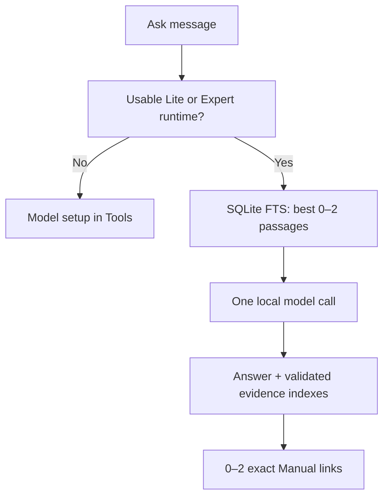

<p align="center">
  
</p>

<h1 align="center">Aurora Survival</h1>

<p align="center">
  <strong>A fully offline survival assistant for iPhone and iPad.</strong>
</p>

<p align="center">
  On-device model inference · a reviewed field manual · signed offline maps · CoreML species identification — all working after the signal disappears.
</p>

<p align="center">
  <a href="LICENSE"></a>
  
  
  
  
  <a href="https://survival.auroraforgelab.com/"></a>
</p>

<p align="center">
  <a href="https://survival.auroraforgelab.com/"><strong>Website</strong></a> ·
  <a href="#build--verify"><strong>Build</strong></a> ·
  <a href="#architecture"><strong>Architecture</strong></a> ·
  <a href="SECURITY.md"><strong>Security</strong></a> ·
  <a href="CONTRIBUTING.md"><strong>Contributing</strong></a>
</p>

---

## Overview

Aurora is a fully offline iPhone and iPad survival assistant. It combines local model
inference, a reviewed field course, an immutable SQLite reference corpus, and signed offline
maps. Questions and selected photos stay on the device, and answers are grounded in exact
passages from the reviewed offline manual.

> Aurora is an educational aid — **not** a replacement for emergency services, certified
> first-aid training, or professional judgment.

## Features

Four independent tabs, in order: **Ask · Manual · Maps · Tools**.

| Tab | What it does |
| --- | --- |
| **Ask** | Answers using an installed on-device model. With no usable model, it shows a setup screen linking to Tools — there is no extractive answer fallback. |
| **Manual** | One versioned SQLite knowledge base: 10 direct wilderness chapters, 70 action lessons, 1,050 indexed passages, primary-source metadata, and 828 reviewed legacy-link dispositions. |
| **Maps** | A dedicated offline-map browser and download manager. |
| **Tools** | Model downloads plus a separate offline Species ID scanner covering 504 North American animals. |

- Signed packages retain Ed25519 verification, SHA-256 checks, path protection, atomic
  activation, recall, offline entitlements, and preparation/incident network controls.
- Chat has no duplicate SOS or Clear control; session conversation stays visible. Photo
  attachment appears only for an approved active Expert vision runtime.
- Vehicle and roadside guidance remains available in Manual and Ask retrieval. Retired
  readiness, trip-sheet, vehicle-profile, OBD, and standalone status subsystems are no longer
  presented; existing user files are not erased.

## Model tiers

| Tier | Target | Runtime state |
| --- | --- | --- |
| **Lite** | iPhone 13-class and comparable devices | Gemma 3 1B local conversation plus survival RAG; current supported tier |
| **Expert** (`vision_expert`) | High-memory devices (iPhone 17 Pro Max, iPad Pro M2+) | Larger 2B-class vision candidate; validation-locked until signed model/projector, mtmd binding, and physical acceptance pass |

Automatic selection recommends the best usable tier from live memory, storage, thermal, Low
Power Mode, package trust, recall, and runtime availability. Expert degrades to Lite when its
gates fail. Legacy Essential or Field preferences migrate to Lite; legacy Field packages
cannot activate.

## Build & verify

**Requirements**

- Xcode with an iOS 26 SDK (see `project.yml` for deployment settings)
- XcodeGen (`brew install xcodegen`)
- Python 3.11+

```bash
xcodegen generate
open Aurora.xcodeproj

python3 tools/validate.py
python3 tools/run_swift_tests.py
```

The app target is universal (`TARGETED_DEVICE_FAMILY = 1,2`). Model and map downloads are the
only network-capable product flows, and are available only during explicit Preparation mode.

## Architecture



**Key files**

- `App/RootView.swift` — four-tab shell with independent navigation roots.
- `App/ToolsView.swift` — two-tier model center.
- `App/MapPackView.swift` — dedicated maps product area.
- `App/GuideLibraryView.swift` — course-first Manual and deep reference browser.
- `Core/ModelRouter.swift` — automatic/manual selection and live eligibility.
- `Core/ModelPreferenceStore.swift` — focused preference persistence and legacy migration.
- `Core/IncidentAssistant.swift` — local model orchestration and exact Manual links.
- `Core/SurvivalKnowledge.swift` — unified read-only Manual, FTS5 retrieval, sources, and legacy navigation.
- `Resources/Models/catalog.json` — Lite and Expert package metadata.

The llama.cpp runtime is checksum-pinned to `b9637`. Model weights are **not** stored in this
repository. See `Docs/MODEL_EXPERIMENTS.md`, `Docs/PHYSICAL_DEVICE_VALIDATION.md`, and
`Docs/IMPLEMENTATION_STATUS.md` for current gates.

## Species ID

BioCLIP-2 runs locally using Core ML. Its roughly 581 MiB fp16 encoder is an optional signed
download, not part of the base app. Photos are never sent off-device. Scanner results are
likely matches — not calibrated certainty, and never permission to approach, handle, or
consume wildlife.

Package delivery uses `https://downloads.auroraforgelab.com`, a production custom domain on the
existing Cloudflare R2 bucket. The previous `r2.dev` endpoint was retired on September 14, 2026
after the owner approved an early cutover. Installed models keep working offline during an
endpoint outage.

## Privacy & security

- Incident text, photos, and location remain on device.
- Downloads are data packages, never executable scripts.
- Every package requires a trusted Ed25519 signature and verified artifacts.
- Package paths cannot be absolute or traverse outside staging.
- An invalid, expired, incomplete, or tampered package is never activated.
- Critical safety and prohibited-scope rules bypass model generation.

Report vulnerabilities privately — see [SECURITY.md](SECURITY.md). Generated guidance may be
incorrect even with references; citation validation is not a guarantee that every statement is
safe.

## Contributing

Contributions are welcome — please read [CONTRIBUTING.md](CONTRIBUTING.md) first. In short:
discuss new features before implementing, keep changes focused, include a regression test and
device/OS details where relevant, and use concise Conventional Commits.

Questions or contact: [guokenny7@gmail.com](mailto:guokenny7@gmail.com).

## License

Aurora-owned code is licensed under the [MIT License](LICENSE). Model weights and content
carry their own separate licenses; see [THIRD_PARTY_NOTICES.md](THIRD_PARTY_NOTICES.md) and
preserve all third-party notices and license exceptions.

<p align="center">
  <sub>Built for the moment the signal disappears. · <a href="https://survival.auroraforgelab.com/">survival.auroraforgelab.com</a></sub>
</p>
